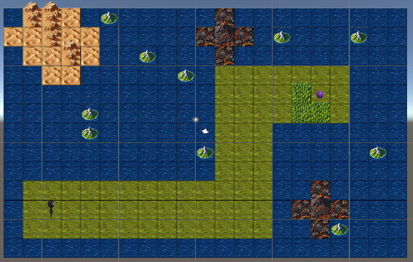

# Scene 0



## If Statements

In this scene you will need to use an [if statement](Docs/CSharp/IfStatements.md).
They are easy to write and [Character](../Raw/Character-cs.md) already provides us with enough information on
how we can use one. Inside Character we have a method called `canMoveForward()` which returns
a bool (A variable that is `true` or `false`). lets say we want the character
to only move forward when it is clear we can write out own method to do that
```csharp

Character controller;

void MoveForwardWhenClear(){
    if (controller.canMoveForward()) // returns true or false based on if the block
                                     // in view is clear
    {
        controller.forward();
    }
}
```

We can now call this in our start method my writing `MoveForwardWhenClear()`.

This teaches two things when you copy and paste a bunch of times this is when you should make a method.
Methods make code easier to understand and easier to read. It teaches you what an API doc is.
When you create a method you are create a part of an API, an API tells us the programmers what a code does.
This means you should name your methods as clear as possible ensuring it describes what it is supposed to do,
you should also not make a method do more than it should so in this case we see at some-point we have to turn.
No method should make the Character turn in our use case's, unless you make it turn a different direction.


Some Methods you should try making:
-
- MoveForwardWhenClear() // requires an if
- TurnMoveRightWhenClear() // requires an if
- TurnMoveLeftWhenClear() // requires an if

A Method you may want to consider is
-
- TurnLeft()

This Method may become helpful since controller.turn() only turns 90 Degrees clockwise or just to the right.
So instead of copy and pasting turn() 3x each time you want to turn left just make a method that turns left.
