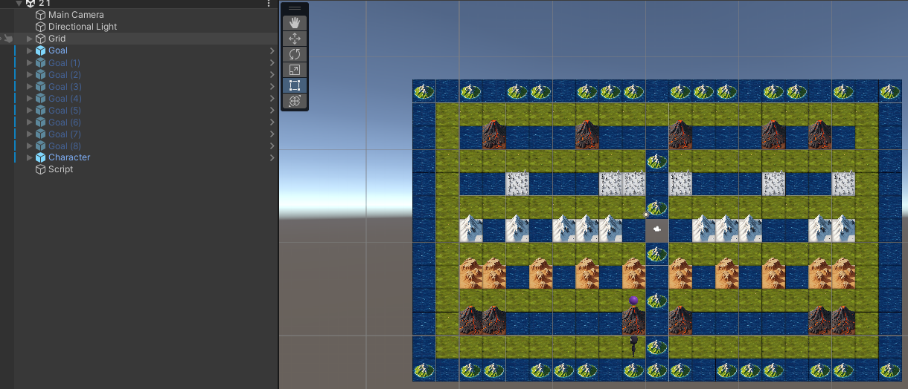

# Scene 2.1



Lets figure out whats going on here. I see 9 `Goal` objects. 8 of them are greyed out,
and only one is visible on the map. Well I did this on purpose. Your Goal is to find
each goal. If you want to cheat, you can enable all of the goals in the inspector by clicking
the check mark next to its name. But it shouldn't be necessary if you look at the map you
may just see where all 9 goals are at already.

## For loops

This project may be best understood with [for loops](Docs/CSharp/ForStatements.md).

```csharp
Character controller;

void turn(int turns){
    for ( int i = 0; // makes a varible i that is 0
          i < turns; // checks if i is less then turns
          i ++       // adds 1 to the varible i
          ) {
          
        controller.turn();      
    }

```

We can use this by calling it like this `turn(7)` this will turn our character 7 times to the right.

the `void turn(int turns)` allows us to write out that our method can take in int's as its parameters, so 
if someone tries entering any non literal integers, it will fail. you do not need to make all methods 
accept variables like this i could make a method like turn left that just does a forloop to call turn left 3 times

## While

while statements are the same as a for statement except while continues while the condition is true

```csharp

while (True){
   controller.forward();
}

```

this will make the character move forward forever until the program is killed or exited;

you can make this into a for loop on its own in many ways `while (CONDITION)` condition is just an if statement so we can
put anything the equates to true or false here. so lets make a method to move forward 3 times:


```csharp

int moves = 0;

while (moves > 3){
   controller.forward();
   moves ++;
}

```

this is the same thing a for loop does just broken to more pieces. 
Do note I wrote `moves > 3` this is because if I said `moves == 3` this is because if we check if it is
3 then it will move 4 times because we move then add like this

```
moves // 0
forward
moves ++ // 1
forward
moves ++ // 2
forward
moves ++ // 3
```

as you can see i have forward() wrote 4 times before moves becomes 3.

you can get around this by writing moves = 1 and then you can check if moves == 3 since this accounts that it will move
the first time.

