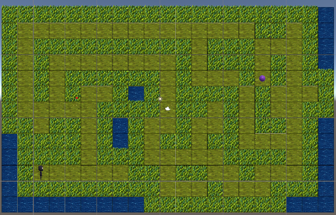

# Scene 2.2

Now using what you learned in the past two assig's try to complete this maze. There
are only one Goal in this map.

## This project may include
- [for loops](../CSharp/ForStatements.md)
  - or even while loops
- [if statement](../CSharp/IfStatements.md)
