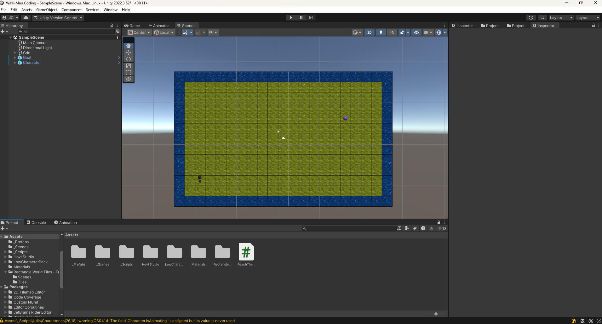

# Sample Scene

Looking at the Hierarchy, you may find you have both a `Character` and a `Goal`.
your objective is to get the `Character` to the `goal`.

Here are two sample paths.

## Before you begin

make sure to follow the [First Script](Docs/First-script.md) tutorial

## code

If you look inside the API Docs of [character](Docs/Raw/Character-cs.md), you will see
some public methods. 
- void forward()
- void turn()
- void Play()
- void print(params object[] args)

### Let go over [class.Method()](Docs/CSharp/ClassMethod.md)

Class.method(); works like this we have a class in this case Character then we have methods
lets take forward() for example. We call forward() either from the class or an object of that class.

```csharp
Character controller;

void myFirstScript(){
    controller.forward();
}
```
in this example we used an object of class Character and used class.method to use the method forward.


### Try to complete it yourself

Count the moves write them out, then program your turns, finish the rest of the moves

### Debugging

if you get lost debugging helps a lot. In this project unity has a timing issue, so
if you try to just call Debug.Log() it will output it long before anything else. Therefore
Character comes with its own print statement. You can use this a few ways:

#### Simple print
```csharp
Character controller;

void start(){
    controller.print("Hello world!");
}

/*
* prints *
 Hello world!
*/
```
#### Print as a type (Log, Warn, Error)
```csharp
Character controller;

void start(){
    controller.print("Warn","Hello world!");
}

/*
* prints *
WARN: Hello world!
*/
```
#### Print out variables
```csharp
Character controller;
int num = 1;
void start(){
    controller.print("Warn",num);
}

/*
* prints *
WARN: 1
*/
```