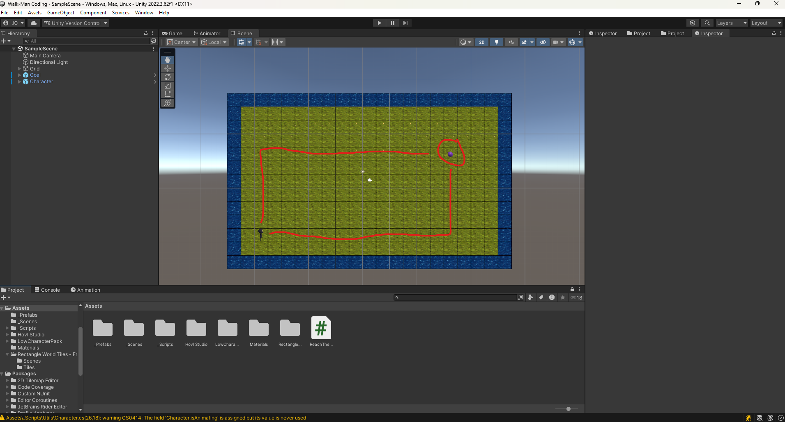

# Sample Scene

Looking at the Hierarchy, you may find you have both a `Character` and a `Goal`.
you objective is to get the `Character` to the `goal`.

Here are two sample paths.

# First
create the `script` object and attach the `Character` to your script

# Second
Count the moves write them out, then program your turn, finish the rest of the moves